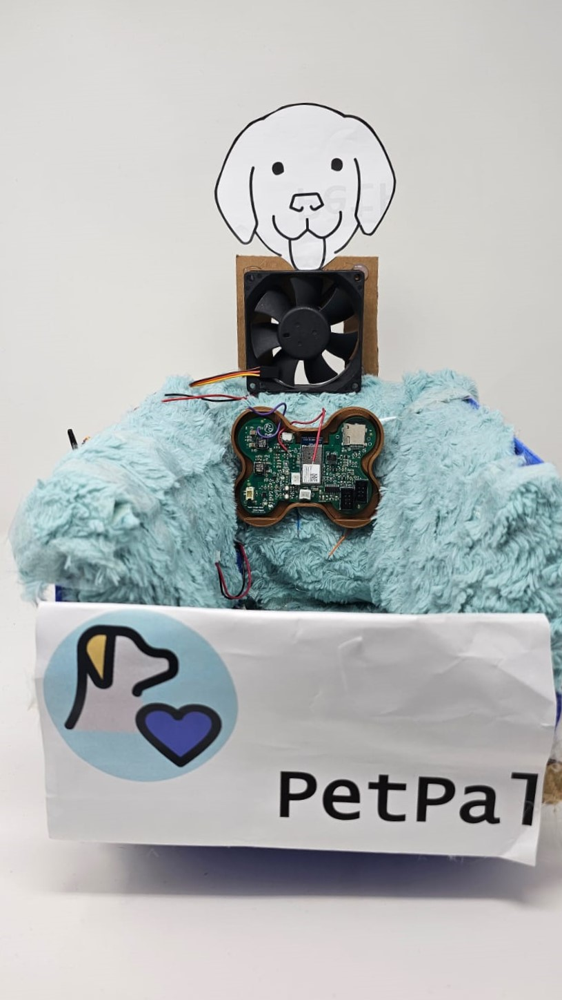
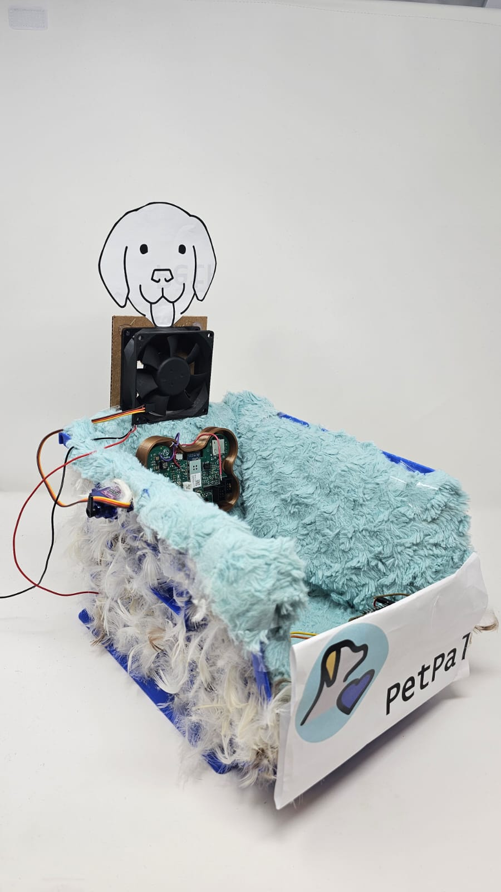
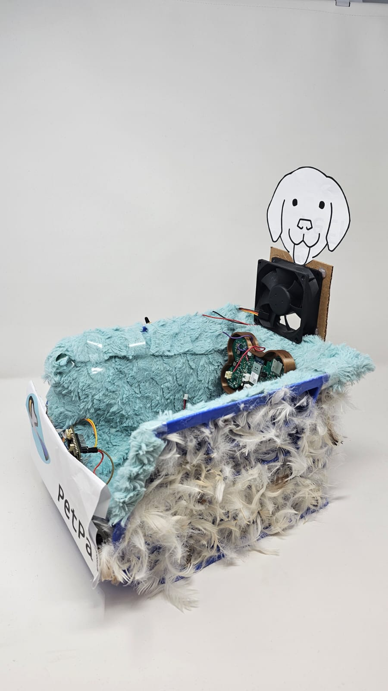
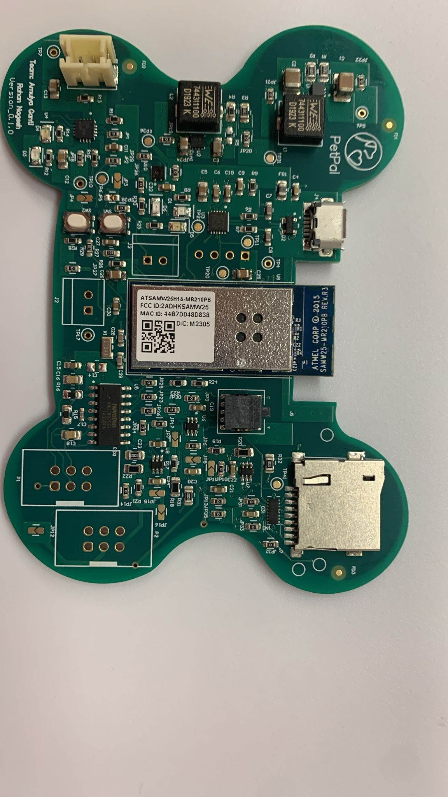
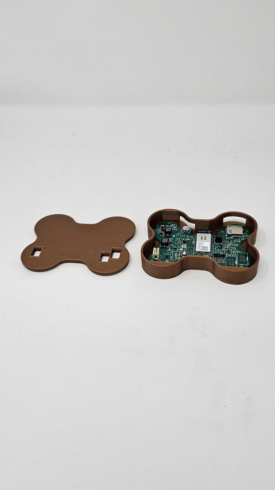
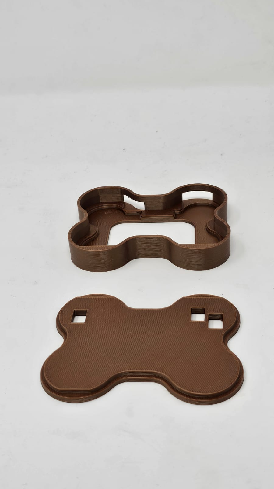

# a14g-final-submission

    * Team Number: 07
    * Team Name: Trailblazers
    * Team Members: Amulya Ganti, Rohan Nagesh
    * Github Repository URL: https://github.com/ese5160/a14g-final-submission-t07-the-trailblazers.git
    * Description of test hardware: ATSamW25 Xplained Pro, SHTC3, NAU7802, LSM6DSO, SG90, DC Fan, DC Heating pad, ESP32 Feather V2

## 1. Video Presentation

## 2. Project Summary
#### Device Description: 

Pets play a crucial role, from  providing companionship to offering emotional support. Over the last three decades, pet ownership has experienced a notable increase. Reflecting the growing trend of pet humanization, the global market size for pet technology that aims to enhance the quality of life of our furry best friends is expected to hit $10.7 billion by 2026.

Introducing PetPal – one such revolutionary solution designed to prioritize the overall well-being of your beloved canine companion!
Picture this: a cutting-edge, smart pet bed that provides a comfy spot for your pooch. Say farewell to costly pet anxiety products and the aftermath of property damages. PetPal comprises of a pet bed and a sub-module that we are referring to as pet collar. The collar utilizes an accelerometer to track the pet’s movements and is connected to the cloud. This allows the user to discern if their pet is trembling anxiously, darting around or engaged in play. The innovative bed on the other hand helps the user to keep track of pet’s weight and offers climate control to create a personalized sanctuary. But that's not all – we've gone the extra mile! The bed is also outfitted with a calming pheromone spray to alleviate their anxiety. As a pet owner, you can effortlessly monitor your pet's activity and engage them directly from your device. Stay connected to your pet's emotional world and enjoy peace of mind, no matter where you are.

#### Inspiration:
The idea to build this product stemmed from 'Buggy', a labrador who experiences social anxiety and tremors when feeling anxious. Taking into consideration, the concerns of many such pet owners, we wanted to build a product that can contribute to the well-being of our beloved furry companions.

#### Device Functionality:

As previously mentioned, the device incorporates three main functions: detecting anxiety, regulating the temperature of the pet bed, and tracking the weight of the pet. To achieve these functionalities, the device is equipped with three sensors and three actuators. An accelerometer attached to the pet's collar detects anxiety, a temperature sensor on the pet bed monitors ambient temperature, and a load cell on the pet bed detects the presence of the dog and tracks its weight. If the temperature of the bed falls below a predetermined threshold, the heating pad (actuator 1) activates, while if the temperature exceeds the threshold, the fan is activated. In the event of the dog trembling due to anxiety, data collected by the accelerometer on the pet collar triggers the servo motor (actuator 3) positioned near the bed to release calming pheromones. All this data is sent over the cloud and displayed on a dashboard in real time. 

#### Challenges:
1. Designing our PCB seemed challenging, particularly as we adopted a dog bone shape while adhering to the project's dimensional requirements.
2. After receing the manufactured board, we found out that our buck converter was not working due to incorrect resistor values in the voltage divider network. We had to desolder the components and resolder in correct configuration.
3. The FTDI circuitry on all three boards failed to function, and after thorough debugging, we determined it was a manufacturing error. To address this issue, we utilized a UART to TTL connector.
4. Given that we had an off-the-shelf module, i.e. IMU data from the pet collar, developing firmware for both collar aand pet bed proved to be a challenging task.

#### Prototype Learnings:
1. Thoroughly reviewing documentation for various sensors, boards, and actuators, with a focus on critical details essential for PCB layout design.
2. Utilizing FreeRTOS API to optimize embedded systems programming efficiency.
3. Design of printed circuit boards in Altium and schematic capture for hardware implementation.
4. We learnt how to design and deploy dashboards and establish communication between nodes and embedded systems through Node-RED.

#### Next Steps:
1. Creating a custom PCB for pet collar and seamelessly integrating in PetPal.
2. We believe anxiety detection is the key distinguishing feature of our product. Presently, we rely solely on IMU data to gauge the dog's anxiety levels. However, in the future, we plan to incorporate a heart sensor to complement the IMU data. This integration will enable us to activate a pheromone spray based on both the heart activity and IMU data.
3. Enhancing the user interface and dashboard
4. Transitioning from the present prototype stage to the next phase, involves considering the appropriate packaging of our product and securing additional funds for further product development.
 
#### Takeaways:

#### Project Links:
Node-RED link: [Here.](http://172.172.34.140:1880/#flow/34c5c4e06c53bbe4)

User-interface: [Here.](http://172.172.34.140:1880/ui/#!/0?socketid=ovA5--m2NUMTkBTpAACv)

A12G Repository: [Here.](https://github.com/ese5160/a11g-board-bringup-t07-the-trailblazers.git)

Altium 365 PCB Link: [Here.](https://upenn-eselabs.365.altium.com/designs/6ACC74F3-2C68-4A00-A48B-9BF6BBB50620)

## 3. Hardware & Software Requirements

## 3.1 Hardware Requirements Specification (HRS):

### HRS 01 - Product Microcontroller:

The product shall utilize the SAMW25 module, incorporating the ATWINC1500 low-power Wi-Fi 2.4 GHz for wireless communication and the SAMD21W module for processing, powered by a 3.3V power supply.

### HRS 02 - Power Source:

The product shall be powered by the BQ24075 charging circuit is employed. This circuit, with a voltage range of 4.4 - 5.25V from USB, shall be supplemented by a 3.3V 2200 mAH Lithium Ion battery. Buck and boost converters shall be employed to generate 5V and 3.3V as outlined in the detailed system design. The product shall not use Lithium Polymer battery for powering.

### HRS - 03 Load Detection:

The product shall employ the SEN-10245 analog sensor to track pet's weight. Additionally, when the load is detected, based on the sensor readings, the actuators shall activate. The sensor shall provide readings with an accuracy of +- 5%.  The minimum load measurable shall be 5kgs and the maximum load measurable shall be 50 kgs.

### HRS - 04 Temperature Sensor:

A temperature sensing solution shall involve the use of the SHTC3-TR-10KS sensor, accurately measuring the surrounding temperature of the pet bed with a precision of +-5%. Operating at an ideal voltage of 3.3V, the device shall be able to measure a desired temperature range of 55 F to 80 F. The sensor shall communicate with SAMW25 using I2C protocol.

### HRS - 05 Anxiety Detection:

For anxiety detection, the product shall utilize the LSM6DSL sensor (6 DoF IMU/accelerometer) to monitor the pet's body for shivering, ensuring a sensitivity of +- 5%. This sensor shall communicate with the ESP8266 module using I2C protocol, which shall upload data to the cloud. Both devices shall be mounted on the pet's collar and operate at 3.3V.

### HRS - 07 Pheromone Actuator:

The product shall integrate the SG90 servo motor to control the spray of pheromone aerosol. Operating at an ideal voltage of 5V with a pulse width modulation period of 20ms, the desired operational range shall be between 0 and 90 degrees, corresponding to a pulse width of 1.5ms to 2ms.

### HRS - 08 Fan Actuator:

Utilizing the Adafruit miniature 5V cooling fan, the product shall activate the fan at an ideal voltage of 5V and 200mA when the temperature rises above 75 F.

### HRS - 09 Heating Pad:

The product shall employ the COM-11289 wearable heating pad, designed to operate at an ideal voltage of 5V and 600mA. The heating pad shall be activated when the temperature drops below 65 F.

## 3.2 Software Requirements Specification (SRS)

The software aspect of the project is a well developed UI for the user who shall be the pet owner to view statistics related to his pet like the ambient temperature, the weight and anxiety.

### SRS 01 - Load Detection:

The product's actuators shall engage exclusively when the presence of the pet on the pet bed is confirmed through acquired weight data. 

### SRS 02 - Stress Detection:

The product shall identify signs of stress in the pet by collecting data from the 6-axis Inertial Measurement Unit (IMU). It combines 3-axis accelerometer and 3-axis gyroscope and shall have a data rate of 6.66KHz.

### SRS 03 - Pheromone Spray Regulation:

The product shall precisely control the release of the pheromone spray by managing the rotation of the servo motor. Clockwise rotation shall be restricted to 90 degrees, and anti-clockwise rotation to 0 degrees.

### SRS 04 - Graphical User Interface (GUI):

The product shall feature a graphical interface for the user (pet's owner) to visualize the pet's mood over time. Additionally, manual control over the actuators (pheromone spray , fan and heating pad) shall be provided through the GUI.

### SRS 05 - Temperature Monitoring:

The system shall acquire temperature data from the environment around the pet bed using a temperature sensor. If the temperature exceeds 35 degrees Celcius or falls below 20 degrees Celcius, the fan or the heating pad shall turn on respectively.

## 4. Project Photos & Screenshots

